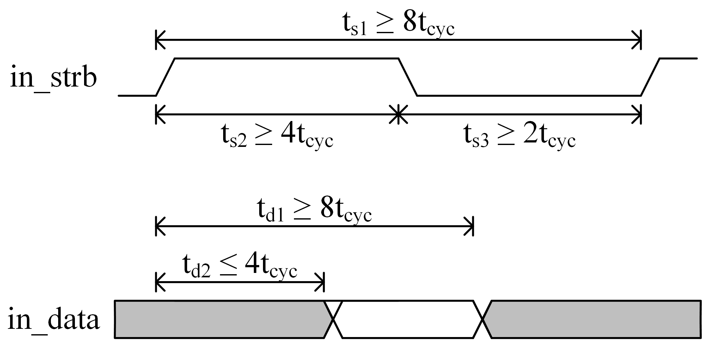

# AoCStream

By [Hyeong-Ju Kang](http://)

## Introduction

AoCStream is a CNN processing accelerator 
	that implements a whole CNN with on-chip memories (All-on-Chip implementation).
The detailed architecture will be presented as a poster in ISFPGA 2023,
	and a full version paper is available on [arXiv](http://arxiv.org/abs/1804.09862).

## Citing AoCStream

Please cite AAP in your publications if it helps your research:

	@article{aocstream_2021,
		author = {Kang, Hyeong-Ju},
		title = {AoCStream: All-on-Chip CNN Accelerator With Stream-Based Line-Buffer Architecture},
		version = {1},
		date = {2011-12-19},
		eprinttype = {arxiv},
		eprintclass = {cs.LG, cs.GT},
		eprint = {http://arxiv.org/abs/1112.4344v1},
		url = {http://arxiv.org/abs/1112.4344v1}
	}
	@inproceedings{aocstream_isfpga,
		author = {Kang, Hyeong-Ju},
		title = {AoCStream: All-on-Chip CNN Accelerator With Stream-Based Line-Buffer Architecture},
		booktitle = {Proceedings of ACM/SIGDA International Symposium on Field Programmable Gate Arrays},
		year = {2023},
		pages = {}
	}

## 1. MobileNet V1 + SSDLiteX

### 1.1. For KCU116 (Xilinx XCKU5P FPGA) Board
Not board confirmed

#### 1.1.1. Maximum Frequency (No PLL)

| Input Size | LUT(K) | Reg(K) | BRAM | URAM | DSP | Clock(MHz) | FPS   | Bit file |
|-----------:|-------:|-------:|-----:|-----:|----:|-----------:|-------|---------:|
| 320x320    | 137    | 218    | 454  | 25   | 464 | 428        | 260.9 | [bit](https://drive.google.com/file/d/1rSn0vXBGPj_jLdUWXfZzaobrAh-2iAKt/view?usp=share_link)|
| 384x384    | 145    | 219    | 454  | 25   | 464 | 349        | 147.7 | [bit](https://drive.google.com/file/d/1BF8wfiuEEXCNpOkSR6QdgJRVJ8KU6vaR/view?usp=share_link)
| 448x448    | 148    | 233    | 476  | 25   | 476 | 400        | 124.5 | [bit](https://drive.google.com/file/d/1Bad1MoeHeb64eP39sMBvUlZ47JWfz_I5/view?usp=share_link)
| 512x512    | 154    | 232    | 476  | 44   | 476 | 375        | 89.3  | [bit](https://drive.google.com/file/d/1eGg7mMmpcELzJOvZvqNMFv-6XMOwZ5KE/view?usp=share_link)

The models can be downloaded at Section 2.1 of [this page](https://github.com/HyeongjuKang/accelerator-aware-pruning)

### 1.2. For NetFPGA 1G CML (Xilinx FPGA) Board

#### 1.2.1. Maximum Frequency (No PLL)
Not board confirmed

| Input Size | LUT(K) | Reg(K) | BRAM | URAM | DSP | Clock(MHz) | FPS   | Bit file |
|-----------:|-------:|-------:|-----:|-----:|----:|-----------:|-------|---------:|
| 320x320    | 156    | 195    | 445  | -    | 360 | 186        | 100.9 | [bit](https://drive.google.com/file/d/1Wn_WueCIx6RE10rYmN0sHD17AISMcEeI/view?usp=share_link)

#### 1.2.1. 60FPS Target
Board confirmed with the example host board on Applendix 2.

| Input Size | LUT(K) | Reg(K) | BRAM | URAM | DSP | Clock(MHz) | FPS   | Bit file |
|-----------:|-------:|-------:|-----:|-----:|----:|-----------:|-------|---------:|
| 320x320    | 147    | 195    | 445  | -    | 360 | 120        | 65.1  | [bit](https://drive.google.com/file/d/1fDAewZxf9j_4ji8r0PRiLnFDaDz-3VGz/view?usp=share_link)

## Appendix 1. Board Interface

### Host to CNN Processing Board

The host sends image data with the following signals.
In the figure, t_cyc means the clock cycle time of the CNN processing.

The in_data signal consists of 26 bits.
- in_data[25]: 1 - on the first pixel of a frame, 0 - o.w.
- in_data[24]: 1 - on the first pixel of a line, 0 - o.w.
- in_data[23:16]: Red
- in_data[15:8]: Blue
- in_data[7:0]: Green

### CNN Processing Board to Host
The CNN processing board sends the detection results with the following signals.
In the figure, t_cyc means the clock cycle time of the CNN processing.

The out_data signal consists of 16 bits.
| out_data[15:13]	| out_data[12:0]					|
|-------------------|-----------------------------------|
| 000				| 7 bit class number (1~81)			|
| 001				| 8 bit probalility (0.xxxxxxxx)	|
| 010				| xmin								|
| 011				| xmax								|
| 100				| ymin								|
| 101				| ymax								|

The counting value out_data[15:13] increments 0 to 5
at the rising edge of in_strb.
The remainig bits of out_data changes accordingly.

## Appendix 2. Example Host Board
Nexys Video board is used for the example host board.
The [HDMI project](https://digilent.com/reference/learn/programmable-logic/tutorials/nexys-video-hdmi-demo/start) of Nexy Video was modifed.
[Zip](https://drive.google.com/file/d/1ZBPjBzdBdqx39g-rahwUH1d2TtX_Gy-3/view?usp=share_link)

